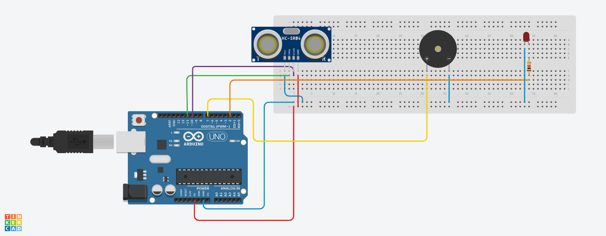

# Ultrasonic Distance Alarm (Arduino)

Ultrasonic distance-based alarm system using **Arduino**, **HC-SR04**, **LED** and **Buzzer**.  
The system measures distance and triggers visual and sound alerts as an object gets closer.

---

## Features
- Distance measurement using HC-SR04
- LED and buzzer warning system
- Buzzer speed increases as object gets closer
- Uses **NewPing** library for reliable readings

---

## Components
- Arduino Uno
- HC-SR04 Ultrasonic Sensor
- Active Buzzer
- LED
- 220Ω Resistor
- Jumper Wires

---

## Pin Connections

### HC-SR04
- VCC → 5V  
- GND → GND  
- TRIG → D8  
- ECHO → D9  

### Buzzer
- + (Long leg) → D2  
- − → GND  

### LED
- Anode (+) → D10 (with 220Ω resistor)  
- Cathode (−) → GND  

---

## Libraries Used
This project uses the **NewPing** library.

### Install via Arduino IDE:
1. Open Arduino IDE  
2. Go to **Sketch → Include Library → Manage Libraries**  
3. Search for **NewPing**  
4. Install the library  

---

## How It Works
- The ultrasonic sensor continuously measures distance.
- When the distance falls below predefined thresholds:
  - LED turns ON
  - Buzzer starts beeping
- As the object gets closer, the buzzer beeps faster.

---

## Distance Behavior

| Distance (cm) | Buzzer Speed |
|--------------|--------------|
| > 50         | Slow         |
| 30 – 50      | Medium       |
| 10 – 30      | Fast         |
| < 10         | Very Fast    |

---

## Notes
- Designed for **active buzzer**
- If using a passive buzzer, replace `digitalWrite()` with `tone()`

---

## Author
**Halil Efe Dincer**

## License
MIT
